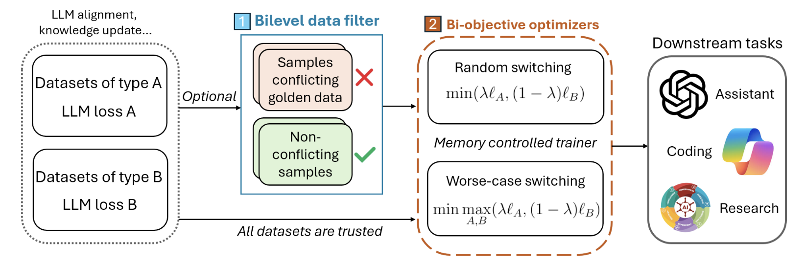

# BiPOST: A Library for Efficient Bi-objective LLM Post-training

A computationally efficient framework for of LLM post-training involving bi-objective and bilevel fine-tuning.

    

  

## Introduction

We introduce BiPOST, a computationally efficient implementation of a bi-objective/bilevel LLM post-training framework that enhances model performance compared to single-objective/single-level LLM training. BiPOST offers a one-stop LLM tuning framework: a pre-trained LLM is optimized for bi-objective in one stage, with comparable memory and runtime cost to sequentially optimizing each objective. The combination of objectives is flexible, and is not limited to the popular case of direct preference optimization (DPO) and supervised fine-tuning (SFT). In addition, BiPOST offers an optional data filtering/selection function that automatically filters out low-quality data given a user-specified golden dataset. As compared to sequential training, BiPOST offers better performance as it mitigates the forgetting issue while keeping the computational complexity under control.

- **Improved post-training performance**: 

- **Similar computational cost as sequential training**: 

