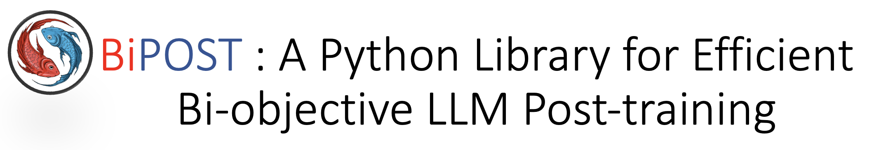

<div align="center">
    
</div>

<hr>

A computationally efficient framework for of LLM post-training involving bi-objective and bilevel fine-tuning.

<div align="center">
    
</div>

## Introduction

preference learning (e.g., with DPO or RLHF) and supervised fine-tuning (SFT). The common sequential approach treats each stage independently, but this can cause the model to forget the first objective when optimizing for the second. We introduce BiPOST, a computationally efficient implementation of a bi-objective/bilevel LLM post-training framework that enhances model performance compared to single-objective/single-level LLM training. BiPOST offers a one-stop LLM tuning framework: a pre-trained LLM is optimized for bi-objective in one stage, with comparable memory and runtime cost to sequentially optimizing each objective.


## Installation

1. Create conda environment

```bash
conda create -n bipost python=3.10
conda activate bipost
```

2. Clone the repository
```bash
git clone https://github.com/Post-LLM/BIPOST.git
```

3. To install BiPOST, Navigate to the top-level of the repo and run
```bash
pip install -e .
```

## Running Example

#### Data selection
The optional bilevel data selection script:

```bash
set -x

read -r -d '' training_commands <<EOF
bipost.cli.train_selector \
   --pretrain EleutherAI/pythia-1b \
   --lora_alpha 16 \
   --lora_rank 16 \
   --target_modules query_key_value \
   --lambd 0.5 \

   --train_batch_size 16 \
   --micro_train_batch_size 1 \
   --learning_rate 1e-5 \

   
   --obj_1 SFT \
   --dataset_1 Open-Orca/OpenOrca \
   --input_key question \
   --output_key response \
   --max_samples_1 9600 \
   
   --obj_2 SFT \
   --dataset_2 yahma/alpaca-cleaned \
   --selector_learning_rate 1e-4 \
   --selector_activation softmax \
   --max_samples_2 9600 \
   
   --save_path ./checkpoint/test_selector \
   --max_epochs 3 \
   --zero_stage 2 \
   --save_steps -1 \
   --logging_steps 1 \
   --eval_steps -1 \
   --bf16 \
   --load_checkpoint \
   --gradient_checkpointing 

EOF
    # --use_wandb [WANDB_TOKENS]

if [[ ${1} != "slurm" ]]; then
    deepspeed --num_gpus 2 --module $training_commands
fi
```

#### Bi-objective optimization

An example bash script on joint knowledge distillation and SFT:
```bash
set -x

read -r -d '' training_commands <<EOF
bipost.cli.train_bi_objective \
   --pretrain meta-llama/Meta-Llama-3-8B \
   --lora_alpha 16 \
   --lora_rank 16 \
   --target_module q_proj v_proj \

   --train_batch_size 32 \
   --micro_train_batch_size 1 \
   --learning_rate 1e-5 \

   --obj_1 KD \
   --dataset_1 Open-Orca/OpenOrca \
   --input_key question \
   --output_key response \
   --max_samples_1 6400 \

   --ref_model meta-llama/Meta-Llama-3-8B-Instruct \
   
   --obj_2 SFT \
   --dataset_2 Open-Orca/OpenOrca \
   --input_key_2 question \
   --output_key_2 response \
   --max_samples_2 6400 \
   
   --save_path ./checkpoint/llama3-8b-kd-sft \
   --max_epochs 2 \
   --zero_stage 3 \
   --save_steps -1 \
   --logging_steps 1 \
   --eval_steps -1 \
   --bf16 \
   --flash_attn \
   --load_checkpoint \
   --gradient_checkpointing 

EOF
    # --use_wandb [WANDB_TOKENS]

if [[ ${1} != "slurm" ]]; then
    deepspeed --module $training_commands
fi
```

## Acknowledgement

We would like to thank all packages this repo is built on, especially

- [OpenRLHF](https://github.com/OpenRLHF/OpenRLHF): for the vanilla SFT and DPO implementation and their great extention capability.
- [DeepSpeed](https://github.com/microsoft/DeepSpeed): for the efficient distributed training functions.
